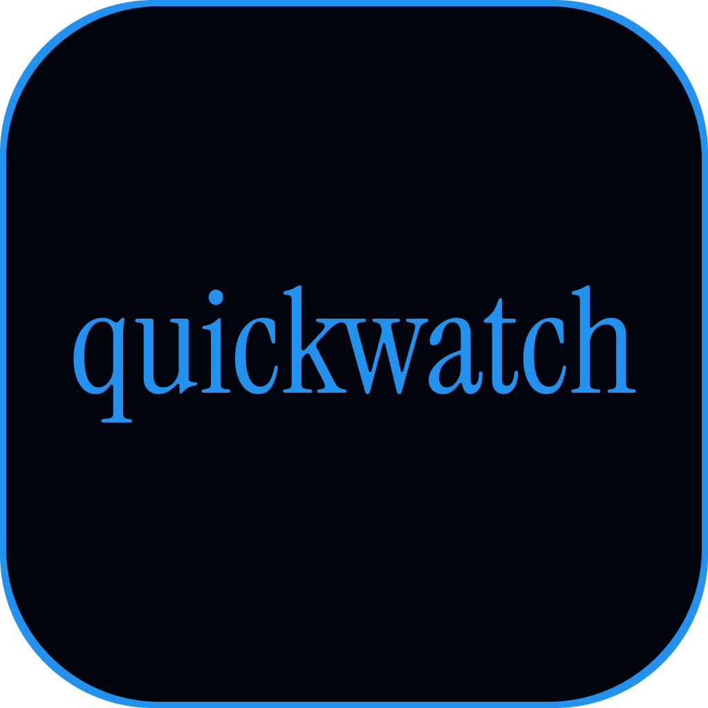

<a id="readme-top"></a>

<!-- PROJECT LOGO -->
<br />
<div align="center">
  <a href="https://github.com/varunaditya-plus/QuickWatch">
    
  </a>

  <h3 align="center">QuickWatch</h3>

  <p align="center">
    A free movie/tv watching website, focused on giving the user the ultimate experience<br />
    Our goal is to offer a speedy and reliable website you can count on.
    <br />
    <br />
    <a href="https://quickwatch.co">Check it out</a>
    &middot;
    <a href="#about-the-project">About the project</a>
    &middot;
    <a href="#getting-started">Getting started</a>
  </p>
</div>


## About The Project

I wanted to watch a show and it wasn't on Netflix, so I made QuickWatch. In all my websites, I prioritize the look and feel of the website over everything, so with QuickWatch I went all out. Everything on this site was made specifically to give you the best movie watching experience.

Here's how:
* Multiple fast and reliable movie watching sources
* A clean website design with web app compatibility for iOS
* A wide movie selection with most popular(ish) movies and tv shows

Of course, no one template will serve all projects since your needs may be different. So I'll be adding more in the near future. You may also suggest changes by forking this repo and creating a pull request or opening an issue. Thanks to all the people have contributed to expanding this template!

When I made QuickWatch, I had to learn a lot about the free movie watching ecosystem, who really hosts the files, and where they come from. I don't want you to have to go through all that BS, so I decided that QuickWatch will be OPEN SOURCE under the GNU General Public License v3.


### Built With


<!-- GETTING STARTED -->
## Getting Started

This is how you can set up your project locally or even host it.
To get a local copy up and running follow these simple example steps.

### Prerequisites

* python
  ```sh
  https://python.org/
  ```
* npm
  ```sh
  npm install npm@latest -g
  ```
* vite
  ```sh
  npm install vite@latest -g
  ```

### Installation

1. Clone the repo
   ```sh
   git clone https://github.com/varunaditya-plus/QuickWatch.git
   ```
3. Install NPM packages
   ```sh
   npm install
   ```
4. Go into the src/config.json and change the first two lines of the json:
   ```json
   { // this is what it is by default
    "proxy": "https://a.quickwatch.co",
    "m3u8proxy": "https://p.quickwatch.co",
   }
   ```
5. Go into the backend in two different terminal instances and run the proxy and m3u8proxy
6. Go back into the src/config.json and change the proxy and m3u8 proxy to whatever they are on your localhost.
7. Done!

<p align="right">(<a href="#readme-top">back to top</a>)</p>


## License

Distributed under the GPL-3.0 License. See `LICENSE.txt` for more information.

<p align="right">(<a href="#readme-top">back to top</a>)</p>
